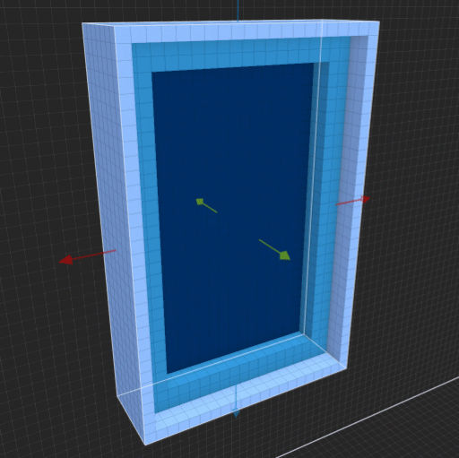

# MagicaVoxel Easy Window shader
> 

> **To use this shader effectively, use the *'Voxel Shader Mode'* tool in the Brush panel to drag out a model cage. This will allow you to modify your object live, using the parameters.**

Easy Window shader helps you create various windows in MagicaVoxel.

See the [introductory video](https://www.youtube.com/watch?v=cVNrDKjBfjc) on YouTube. **Make sure captions are enabled to see explanations!**

To install, download the *'mvs-easy-window.txt'* file and place it into your *'MagicaVoxel > shader > custom'* folder. (If you don't have a *'custom'* folder inside your *'shader'* folder, you can either create the folder yourself or just place the file into the *'shader'* folder.)

## Parameters
**Orientation:** [0 - 3]  
Allows you to rotate the model in 90 degree increments. Depending on which 3D pane you create the model cage (X, Y, -X, -Y), you might see the model oriented incorrectly or facing outwards. Adjust this parameter to correctly orient the model.

**Style:** [0 - 1]  
The Style parameter selects how the window grilles will be generated. 

When 0 is selected, the window grilles will be generated like a seamless grid pattern. As you adjust the width and height of the model cage, the window panes and grilles will be revealed like an infinite grid pattern starting from the bottom left corner. In this generation method the number of grille parameters (*'H Grilles'* and *'V Grilles'*) will have no effect, since an unlimited number of grilles will be created.

When 1 is selected, a set number of horizontal and vertical grilles will be generated (specified by the *'H Grilles'* and *'V Grilles'* parameters) and the window grilles will be generated from the center of the window. Regardless of the number of horizontal and verticall grilles and their spacing values, when you enlarge the model cage the grilles will not repeat (like in the Stlye-0 case) and still be centered in the middle of the window.

You can generate a wide variety of window styles when you combine the frame/grille size, grille spacing and offset, number of grilles, and glass/grille inset values. You can set most of these parameters independently for the horizontal and vertical grilles.

In order to have the left/right and top/bottom parts of the window align with the panes and grilles correctly, in some case you will have to adjust the model cage.

See the [introductory video](https://www.youtube.com/watch?v=cVNrDKjBfjc) on YouTube for a more practical demo between the two different styles.

**Show Glass:** [0 - 1]  
Shows or hides the glass pane.

**Glass Color:** [1 - 255]  
Specifies the glass color using a palette index. (The color of the window frame will use the currently selected palette color and you can change it by simply selecting a different color from the palette.)

**Grille Color:** [1 - 255]  
Specifies the grille color using a palette index.

**Frame Size:** [1 - 255]  
The size (thickness) of the window frame.

**Grille Size:** [1 - 255]  
The size (thickness) of the grilles.

**Glass inset:** [0 - 255]  
Pushes the glass pane back, towards the end of the window by this many voxels. When the value is zero (0), the glass extends all the way to the front of the window. The glass will stop at the back and at the front of the window. If you don't want to have glass in the window, set the *'Use Glass'* parameter to zero (0). This parameter works in conjuction with the *'Grille Inset'* parameter.

**Grille Inset:** [0 - 255]  
Pushes the window grilles back towards the end of the window by this many voxels. When the value is zero (0), the grille extends all the way to the front of the window. This parameter works in conjuction with the *'Glass Inset'* parameter.

The grilles can never be positioned behind the glass. Therefore, if the glass is inset by, say, 5 voxels, the grille can only be inset by 5 voxels as well. You can still specify higher values but it will not have any effect on the grille and it won't move further back. It stops at the glass.

However, the glass can push the grilles to the front of the window. For example, if the glass is inset (pushed back) by 10 voxels and the grille is inset (pushed back) by 5 voxels, when you decrease the glass inset (to move it towards the front of the window), once the glass position reaches the grille, it will start pushing the grille with it towards the front of the window. Then, when you increase the glass inset again (pushing it back), it will pull the grill inset with it backwards until the grill reaches its own inset value. At which point the grill will stop moving but you can still continue to move the glass further back.

**V/H Grilles:** [0 - 128]  
The number of grilles to create. Can be specified independently for both vertical and horizontal grilles. The maximum value is set at 128 because, as a minimum, you always have to have at least 1 voxel spacing between grilles. When you create 128 grilles with 1 spacing between each grille, it will add up to 255, which is the maximum model size in MagicaVoxel.

**V/H Grille Spacing:** [1 - 255]  
The spacing between the grilles. Can be specified independently for both vertical and horizontal grilles.

**V/H Grille Offset:** [-255 - 255]  
This value will push the grilles up/down (for vertical grilles) and left/right (for horizontal grilles). Can be specified independently for both vertical and horizontal grilles.

## Examples for Style-0 windows

## Examples for Style-1 windows

